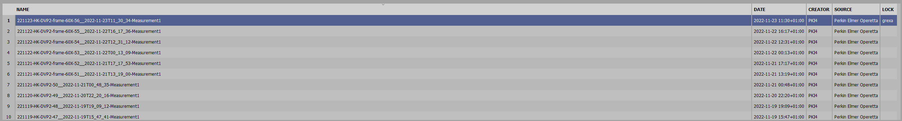
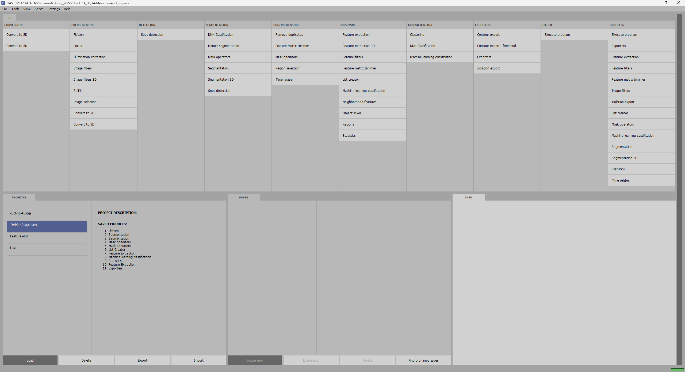
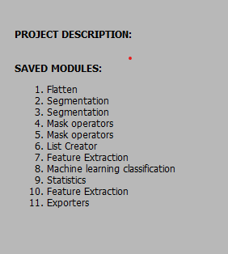

# Proteomic map of mitosis

## Requirements

<ul>
  <li>OS: compatiable with Windows, Linux, Mac (NVIDIA related features will run only on CPU)</li>
  <li>BIAS lite 1.10 or higher</li>
  <li>Matlab 2022b with deeplearning toolbox</li>
  <li>Python 3.9 requirements.txt included</li>
</ul>
 <br>

## Resources

Proteomics data: https://doi.org/10.5281/zenodo.11612461 <br>
Validation data: https://doi.org/10.5281/zenodo.11257150 <br>
DRP models: https://doi.org/10.5281/zenodo.11612600 <br>
DRP training data: https://doi.org/10.5281/zenodo.13896968 <br>

## Install BIAS software:

Download the lite version of the BIAS software from:
https://single-cell-technologies.com/download/

Unzip the bias_win_lite_v1.1.0.zip (version might change) into a desired folder eg:

C:/BIAS/

Run BIAS.exe

Typically it takes 1-2 minutes to unpack the software, no further installion is required.


## Python enviroment
Install python 3.9 <br>

https://www.python.org/downloads/release/python-390/

Create a virtualenviroment, and activate:

Run 

```
pip install -r requirments.txt

```
Typically it takes 5-6 minutes to download and install each packages


## BIAS pipelines

Download the dataset: <br>

Proteomics data: https://doi.org/10.5281/zenodo.11612461

Validation data: https://doi.org/10.5281/zenodo.11257150

Unzip the data to any folder
example:
D:/datasets/Bias_data_DVP2/Proteomics/

The folder structure after unzipping should be:
data, luts, modules

Copy the path into Working folder 
example:
D:/datasets/Bias_data_DVP2/Proteomics/

and Click on Start
<br>


<br>
<br>
After loading a main window should aprear.
Select any screening and double click on it:
<br>
<br>

<br><br>
This will load the content of the whole analysis. Using the modules in the project the analysis can be reproduced
<br>

## Image processing for DVP
<br>
<br>

DVP2-40stgs-basic project 
<br>
<br>


<br>

On the left side projects tab select DVP2-cutting_40stgs-basic<br>
This project contains the original screening data, and image processing steps.

<br>

<br><br>
Flatten module: creates a maximum intensity projection of each focal plane <br>
Segmentation module (Seg-nuc): Uses generic nucleus segmentation (NucleAIzer.org) for nucleai detection<br>
Segmentation module (Seg-cyto): Uses generic citoplasm model (unpublished) for tubule detection<br>
Mask Operator module (Nuc-filer):  Removes nucleais that are in the corner of the images<br>
Mask Operator module (Relab-cyto): Connectes each Cytoplasm  labels to a corresponding nucleai segmentation based on image coordinates.<br> Excludes those nucleais and cytoplasms when there is no correspondance.<br>
List Creator: <br>
Feature Extraction: Generates  features (Area, Eclipse Eccentrity,...) into a table <br>
Machine  learning classification: Uses simple classification to determine if a segmentation is not a cell or incomprehensible, or dead cells.<br> These will be classified as Junk.<br>
Statistics: Creates a new list containinig  only the filtered cells.<br>
Feature Extraction: <br>
Exporter: Exports the data into ACC compatible format for Deep Regression plane(drp) prediction <br>


## Deep regression plane


### Training


#### Download Training Data
Download the training data for the regression plane from the following link:  
[https://doi.org/10.5281/zenodo.13896968](https://doi.org/10.5281/zenodo.13896968)

---

#### Dataset Preparation

1. **Normalize Intensities**  
   Run the script `classification/normalizeIntensities.m`.  
   - **Input**: Images file.  
   - **Output**: ImgNorm files.  

   ```matlab
   % Normalize intensities
   normalizeIntensities('data/Images', 'output/ImgNorm');
   ```

2. **Apply Intensity Normalization**  
   Run the script `applyIntensityNormalization.m`.  
   - **Inputs**:  
     - `data/Images` folder.  
     - ImgNorm files.  
   - **Outputs**:  
     - `data/ImagesNormalized` folder containing images in 8-bit JPG format.  

   ```matlab
   % Apply intensity normalization
   applyIntensityNormalization('data/Images', 'output/ImgNorm', 'data/ImagesNormalized');
   ```

3. **Split into Training and Validation Sets**  
   Run the script `trainingSetSplitter_v3.m` for each data folder.  
   - **Input**: `data/ImagesNormalized`.  
   - **Outputs**:  
     - Target folder structure:  

       ```
       Target/
       ├── Train/
       │   ├── Images/
       │   │   └── *.jpg
       │   ├── Labels/
       │       └── *.tif
       ├── Val/
           ├── Images/
           │   └── *.jpg
           ├── Labels/
               └── *.tif
       ```

   - Additionally results in the `dataset_nameDensity` file.  

   ```matlab
   % Split dataset into train and validation sets
   trainingSetSplitter_v3('data/ImagesNormalized', 'output/Target');
   ```

4. **Generate Density File**  
   Run the script `density.m`.  
   - **Input**: Target folder.  
   - **Output**: `total_density.mat` file.  

   ```matlab
   % Generate density file
   density('output/Target', 'output/total_density.mat');
   ```

5. **Create Augmentations**  
   Run the script `createAugmentationsForFilesBalanced_v2_2.m`.  
   - **Inputs**:  
     - `total_density.mat` file.  
     - Target folder with Train and Val subfolders.  
   - **Outputs**: Augmented data in the respective folders.  

   ```matlab
   % Create augmentations
   createAugmentationsForFilesBalanced_v2_2('output/total_density.mat', 'output/Target');
   ```

6. **Convert to Classification Format**  
   Run the script `convertToClassificationFormat.m` to prepare the data for classification.

   ```matlab
   % Convert to classification format
   convertToClassificationFormat('output/Target');
   ```

####  Run training

  Run `trainv26.m`


### Inference
<br>

Open matlab 2022b
Navigate into drp project folder
Download the latest DRP models from
https://doi.org/10.5281/zenodo.11612600 <br>
In predictForBIASBulk.m

set the path of the downloaded regression model <br>
```
regressionModelPath = '/drp/models/DRP_train_result_ws-21-Jan-2022_04_13_24_v38.mat'
```
<br>
add the path of the downloaded regression model <br>
<br>

```
classificationModelPath = './drp/models/DRP_train_result_ws-21-Jan-2022_18_59_36_classif_v3_resnet50.mat'
```

<br>
<br>

To run the prediction <br>
open testRegressionPlane.m

set the "acc_folder varriable to the path of DVP export"

```
acc_folder = './DVP2-export/DVP2-Val-C1-2/'
```

<br>
run the code

add the path of the downloaded regression model


## Export features, small crops

In "export_features_plots_small_crops.py" line 2
set you BIAS_PATH varriable to your BIAS  path
set myWorkingDir variable to the path of the bias projectes
set myOutputDir to any desired  path where the output will be stored

Example:
```
BIAS_PATH = "C:/BIAS/"

myWorkingDir = "e:/DVP2/Validation/"

myOutputDir = "e:/DVP2/"
```
Run 
<br>
```
python3 export_features_plots_small_crops.py
```

This script will generate csv file from the extracted features, and saves the predicted cells in small image.
## Protein Validation
## Generate intensitiy plots of the features classwise 

In generate_intensity_plots.py set path, and file variable, and select the features to extract
```

path = "e:/DVP2/CODE from hydra/koosk/output/BIAS-DVP2-RNA-val20230926/"
file = "validation-exp-230926.csv"
features_to_extract = ['CYTO INTENSITY-MEAN Alexa 647', 'CYTO INTENSITY-MEDIAN Alexa 647'
    , 'CYTO INTENSITY-INTEGRATED Alexa 647']
```

<br>
```
python3 generate_intensity_plots.py
```
This script will generate plots from the selected  features classwise. Each feature will have a folder and all samples are generated into that folder.

## Reload Regression plane predictions

In bias....

## Single cell selection and export for isolation

To view the predicted mitotic cells in BIAS open: <br>

cutting-40stgs project 
contains each the acc predicted 40 mitotic stages


Open postprocessing files
Run dvp2_export.py
This script will generate small crops for each mitotic cells, and generate a csv files containing 
all feature calculated by BIAS

# Proteomic Data Analysis

The following paragraphs contains the workflow of the proteomic data analysis, focusing on the detection of proteins whose abundance changes significantly.

## Data Analysis

### Raw Data Processing
Raw files were analyzed using the [DIA-NN](https://github.com/vdemichev/DiaNN) (version 1.8.1), a neural network-based search engine. The search was performed against the [UniProt database](https://www.uniprot.org) (March 2023 release, UP000005640_9606 and UP000005640_9606_additional), using a library-free approach. Settings included:
- Fragment and precursor m/z: 100 to 1700
- Peptide length: 7 to 30 amino acids
- Precursor charge range: 2 to 4
- Max number of missed cleavages and variable modifications: 2
- N-terminal modifications: Methionine excision, oxidation, and N-terminal acetylation
- Mass accuracy: 1.5e-05 (both MS2 and MS1)
- Match between runs: Enabled
- Exclusion: 2 empty raw files

### Data Processing and Visualization
Out of 123 analyzed samples, three were excluded due to insufficient protein groups (<3000). Using [Perseus](http://www.coxdocs.org/doku.php?id=perseus:start) (v2.0.5.0), 1385 out of 5735 protein groups were removed due to inadequate quantification across samples. Further steps included:
- Batch correction using [ComBat](https://github.com/Jfortin1/ComBatHarmonization)
- Contaminant removal with AlphaPeptStats (https://github.com/MannLabs/alphapeptstats)
- Statistical analysis: Differential abundance and Kruskal–Wallis test between mitotic classes, performed in Perseus
- Identification of 147 significantly changed proteins across 41 time points
- Grouping of mitotic subphases for enhanced statistical power
- Identification of 1060 significantly changed proteins across 14 time points

### Hit Selection
Proteins with significant expression changes during mitosis were identified using the Kruskal–Wallis test, with false discovery rates (FDR) at 0.1 and 0.05 (Benjamini–Hochberg correction), analyzed in Perseus.


## Visualize proteomic results
In 
```
./analysis
```
run "Protein_plotting.py" file
add necessary parameters

```
   # path of files
    path = "./data/"
    # output of proteomics results

    protein_data_file = "./data/protein_data_only_validated_proteins.txt"
    # list of significant proteins each row contains a protein example: MDC1
    significant_protein_list_file = "./data/sig_proteins.csv"
    # This should be an output from gene scape xlsx format
    # protein_data = './data/output_reportgenerator_trans_20230413.csv'
    protein_information_file = 'DVP2_interesting_GenScrape_output.xlsx'
    doc_filename_dvp2 = 'dvp2_1-2-3_replicates_gene'

    # palette example
    # dots = [(0, 255, 0), (0, 255, 100), (0, 255, 0), (0, 255, 50)]
    # single color example
    dots = [(0, 255, 0)]
    # line color
    line_c = (0, 0, 0)
    # this will remove unnecessary from the visualization
    remove_these_phases_from_plots = []
```


