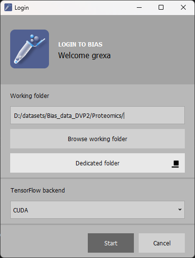

# Proteomic map of mitosis

## Requirements

<ul>
  <li>OS: doesn't matter</li>
  <li>BIAS lite 1.10 or higher</li>
  <li>Matlab 2022b with deeplearning toolbox</li>
  <li>Python 3.9 requirements.txt included</li>
</ul>
 <br>


## Install BIAS software:

Download the lite version of the BIAS software from:
https://single-cell-technologies.com/download/

Unzip the bias_win_lite_v1.1.0.zip (version might change) into a desired folder eg:

C:/BIAS/

Run BIAS.exe

## Python enviroment
Install python 3.9 <br>

https://www.python.org/downloads/release/python-390/

Create a virtualenviroment, and activate:

Run 

```
pip install -r requirments.txt

```


## BIAS pipelines

Download the data from: {zenoodo link }
Unzip the data to any folder
example:
D:/datasets/Bias_data_DVP2/Proteomics/

The folder structure after unzipping should be:
data, luts, modules

Copy the path into Working folder 
example:
D:/datasets/Bias_data_DVP2/Proteomics/

and Click on Start
<br>


<br>
<br>
After loading a main window should aprear.
Select any screening and double click on it:
<br>
<br>

<br><br>
This will load the content of the whole analysis. Using the modules in the project the analysis can be reproduced
<br>

## Image processing for DVP
<br>
<br>

DVP2-40stgs-basic project 
<br>
<br>


<br>

On the left side projects tab select DVP2-cutting_40stgs-basic<br>
This project contains the original screening data, and image processing steps.

<br>

<br><br>
Flatten module: creates a maximum intensity projection of each focal plane <br>
Segmentation module (Seg-nuc): Uses generic nucleus segmentation (NucleAIzer.org) for nucleai detection<br>
Segmentation module (Seg-cyto): Uses generic citoplasm model (unpublished) for tubule detection<br>
Mask Operator module (Nuc-filer):  Removes nucleais that are in the corner of the images<br>
Mask Operator module (Relab-cyto): Connectes each Cytoplasm  labels to a corresponding nucleai segmentation based on image coordinates.<br> Excludes those nucleais and cytoplasms when there is no correspondance.<br>
List Creator: <br>
Feature Extraction: Generates  features (Area, Eclipse Eccentrity,...) into a table <br>
Machine  learning classification: Uses simple classification to determine if a segmentation is not a cell or incomprehensible, or dead cells.<br> These will be classified as Junk.<br>
Statistics: Creates a new list containinig  only the filtered cells.<br>
Feature Extraction: <br>
Exporter: Exports the data into ACC compatible format for Deep Regression plane(drp) prediction <br>


## Deep regression plane
<br>

Open matlab 2022b
Navigate into drp project folder

In predictForBIASBulk.m

set the path of the downloaded regression model <br>
```
regressionModelPath = '/drp/models/DRP_train_result_ws-21-Jan-2022_04_13_24_v38.mat'
```
<br>
add the path of the downloaded regression model <br>
<br>

```
classificationModelPath = './drp/models/DRP_train_result_ws-21-Jan-2022_18_59_36_classif_v3_resnet50.mat'
```

<br>
<br>

To run the prediction <br>
open testRegressionPlane.m

set the "acc_folder varriable to the path of DVP export"

```
acc_folder = './DVP2-export/DVP2-Val-C1-2/'
```

<br>
run the code

add the path of the downloaded regression model


## Export features, small crops

In "export_features_plots_small_crops.py" line 2
set you BIAS_PATH varriable to your BIAS  path
set myWorkingDir variable to the path of the bias projectes
set myOutputDir to any desired  path where the output will be stored

Example:
```
BIAS_PATH = "C:/BIAS/"

myWorkingDir = "e:/DVP2/Validation/"

myOutputDir = "e:/DVP2/"
```
Run 
<br>
```
python3 export_features_plots_small_crops.py
```

This script will generate csv file from the extracted features, and saves the predicted cells in small image.
## Protein Validation
## Generate intensitiy plots of the features classwise 

In generate_intensity_plots.py set path, and file variable, and select the features to extract
```

path = "e:/DVP2/CODE from hydra/koosk/output/BIAS-DVP2-RNA-val20230926/"
file = "validation-exp-230926.csv"
features_to_extract = ['CYTO INTENSITY-MEAN Alexa 647', 'CYTO INTENSITY-MEDIAN Alexa 647'
    , 'CYTO INTENSITY-INTEGRATED Alexa 647']
```

<br>
```
python3 generate_intensity_plots.py
```
This script will generate plots from the selected  features classwise. Each feature will have a folder and all samples are generated into that folder.

## Reload Regression plane predictions

In bias....

## Single cell selection and export for isolation

To view the predicted mitotic cells in BIAS open: <br>

cutting-40stgs project 
contains each the acc predicted 40 mitotic stages


Open postprocessing files
Run dvp2_export.py
This script will generate small crops for each mitotic cells, and generate a csv files containing 
all feature calculated by BIAS

